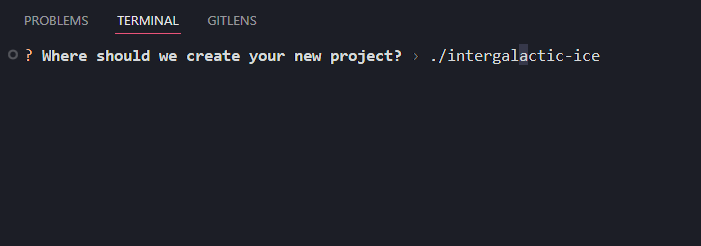

# Create Roblox App

[](https://opensource.org/licenses/MIT)
[![pesde](https://img.shields.io/badge/dynamic/json?url=https%3A%2F%2Fregistry.pesde.daimond113.com%2Fv1%2Fpackages%2Ffrostproject%252Fcreate_roblox_app%2Flatest%2Flune&query=%24.version&style=flat&logo=data%3Aimage%2Fsvg%2Bxml%3Bbase64%2CPHN2ZyB2aWV3Qm94PSIwIDAgMTAwIDEwMCIgZmlsbD0ibm9uZSIgeG1sbnM9Imh0dHA6Ly93d3cudzMub3JnLzIwMDAvc3ZnIj4KPHBhdGggZmlsbC1ydWxlPSJldmVub2RkIiBjbGlwLXJ1bGU9ImV2ZW5vZGQiIGQ9Ik00OS42MDI1IDBMOTIuOTAzOCAyNVY3NUw0OS42MDI1IDEwMEw2LjMwMTI3IDc1VjI1TDQ5LjYwMjUgMFpNMTQuMzAxMyAyOS42MTg4TDQ5LjYwMjUgOS4yMzc2TDg0LjkwMzggMjkuNjE4OFY3MC4zODEyTDQ5LjYwMjUgOTAuNzYyNEwzMy42MTQ4IDgxLjUzMTlWNjcuMzg0OEMzNC41MTY3IDY4LjUwNzEgMzUuNjM4OCA2OS40MjE1IDM2Ljk4MSA3MC4xMjc5QzM4Ljk3MDEgNzEuMTQ4IDQxLjAzNTcgNzEuNjU4IDQzLjE3NzkgNzEuNjU4QzQ2LjQ0MiA3MS42NTggNDkuMTQ1MiA3MC44OTI5IDUxLjI4NzMgNjkuMzYyOUM1My40ODA1IDY3Ljc4MTggNTUuMTEyNiA2NS43NjcyIDU2LjE4MzYgNjMuMzE5QzU3LjA5MTUgNjEuMzM4MiA1Ny42MzIgNTkuMjc0IDU3LjgwNTQgNTcuMTI2M0M1OS44NzIzIDU3Ljc0NTcgNjIuMjE1NyA1OC4wNTU0IDY0LjgzNTYgNTguMDU1NEM2Ny42OTE4IDU4LjA1NTQgNzAuMzY5NSA1Ny42NDczIDcyLjg2ODYgNTYuODMxM0M3NS4zNjc4IDU1Ljk2NDIgNzcuNDA3OSA1NC44MTY3IDc4Ljk4OSA1My4zODg2TDc1Ljc3NTggNDcuODAzOEM3NC41NTE3IDQ4LjkyNTggNzIuOTk2MSA0OS44NDM5IDcxLjEwOSA1MC41NTc5QzY5LjIyMTkgNTEuMjIxIDY3LjIwNzMgNTEuNTUyNSA2NS4wNjUyIDUxLjU1MjVDNjEuMzkyOSA1MS41NTI1IDU4LjY2NDMgNTAuNjg1NCA1Ni44NzkyIDQ4Ljk1MTNDNTYuNzE5NSA0OC43OTYyIDU2LjU2NyA0OC42MzY1IDU2LjQyMTcgNDguNDcyQzU1LjYxMDIgNDcuNTUzOSA1NS4wMjExIDQ2LjQ4OTYgNTQuNjU0NiA0NS4yNzkxTDU0LjY0NDMgNDUuMjQ1Mkw1NC42NjkgNDUuMjc5MUg3OS4yMTg1VjQxLjk4OTRDNzkuMjE4NSAzOS4wMzEzIDc4LjU1NTUgMzYuMzUzNiA3Ny4yMjk0IDMzLjk1NjVDNzUuOTU0MyAzMS41NTkzIDc0LjA5MjcgMjkuNjQ2NyA3MS42NDQ1IDI4LjIxODZDNjkuMjQ3NCAyNi43Mzk1IDY2LjM2NTcgMjYgNjIuOTk5NSAyNkM1OS42ODQzIDI2IDU2LjgwMjcgMjYuNzM5NSA1NC4zNTQ1IDI4LjIxODZDNTEuOTA2NCAyOS42NDY3IDUwLjAxOTMgMzEuNTU5MyA0OC42OTMyIDMzLjk1NjVDNDcuNjc0MyAzNS43OTgzIDQ3LjA0NjkgMzcuODA1NyA0Ni44MTA4IDM5Ljk3ODhDNDUuNjg4OCAzOS43MjggNDQuNDc3OCAzOS42MDI2IDQzLjE3NzkgMzkuNjAyNkM0MS4wMzU3IDM5LjYwMjYgMzguOTcwMSA0MC4xMTI3IDM2Ljk4MSA0MS4xMzI3QzM1LjMxNjIgNDEuOTY1MSAzMy45OTAyIDQzLjE1NDkgMzMuMDAyOCA0NC43MDIzVjQwLjM2NzdIMjAuNjg1NVY0Ni4yNTg1SDI1LjgxMTNWNzcuMDI2NkwxNC4zMDEzIDcwLjM4MTJWMjkuNjE4OFpNNTUuMTk2MSAzNi4wOTg2QzU0LjY1MjggMzcuMTAxNSA1NC4zMzIxIDM4LjEyMTYgNTQuMjM0IDM5LjE1ODhINzEuNzk3NkM3MS43OTc2IDM4LjAzNjcgNzEuNDQwNSAzNi45NDAxIDcwLjcyNjUgMzUuODY5MUM3MC4wNjM0IDM0Ljc0NyA2OS4wNjg5IDMzLjgwMzUgNjcuNzQyOCAzMy4wMzg0QzY2LjQ2NzcgMzIuMjczNCA2NC44ODY3IDMxLjg5MDggNjIuOTk5NSAzMS44OTA4QzYxLjExMjQgMzEuODkwOCA1OS41MDU4IDMyLjI5ODkgNTguMTc5OCAzMy4xMTQ5QzU2LjkwNDcgMzMuODggNTUuOTEwMSAzNC44NzQ1IDU1LjE5NjEgMzYuMDk4NlpNNDkuNjQ1MSA1MS41NjkyQzQ5LjMwNzYgNTAuNjY0MSA0OC44MzgxIDQ5Ljg3MSA0OC4yMzY3IDQ5LjE4OThDNDguMDg4NSA0OS4wMjE5IDQ3LjkzMjMgNDguODYwOSA0Ny43NjgxIDQ4LjcwNjdDNDYuMDg1IDQ3LjA3NDYgNDQuMDQ0OSA0Ni4yNTg1IDQxLjY0NzggNDYuMjU4NUM0MC4xMTc3IDQ2LjI1ODUgMzguNjEzMSA0Ni41NjQ1IDM3LjEzNCA0Ny4xNzY2QzM1Ljg1OTQgNDcuNjc3MyAzNC42ODYzIDQ4LjU0MzggMzMuNjE0OCA0OS43NzU5VjYxLjQ3QzM0LjY4NjMgNjIuNjY2NCAzNS44NTk0IDYzLjUzNzggMzcuMTM0IDY0LjA4NEMzOC42MTMxIDY0LjY5NjEgNDAuMTE3NyA2NS4wMDIxIDQxLjY0NzggNjUuMDAyMUM0NC4wNDQ5IDY1LjAwMjEgNDYuMDg1IDY0LjE4NjEgNDcuNzY4MSA2Mi41NTRDNDkuNDUxMiA2MC45MjE5IDUwLjI5MjggNTguNjAxMiA1MC4yOTI4IDU1LjU5MjFDNTAuMjkyOCA1NC4wNjc5IDUwLjA3NjkgNTIuNzI3IDQ5LjY0NTEgNTEuNTY5MloiIGZpbGw9IiNGMTlEMUUiPjwvcGF0aD4KPC9zdmc%2B&label=pesde&color=f19d1e&link=https%3A%2F%2Fpesde.dev%2Fpackages%2Ffrostproject%2Fcreate_roblox_app)](https://pesde.dev/packages/frostproject/create_roblox_app)
[](https://github.com/frostproject/create-roblox-app/actions/workflows/ci.yaml)
[](https://github.com/frostproject/create-roblox-app/actions/workflows/release.yaml)
[](https://discord.gg/nPVG4fqvxd)

> 📦 Set up a modern roblox app by running one command.

<br>

> [!IMPORTANT]
> This project currently only supports libraries. Game and plugin support will be added in future releases. For any issues you encounter, please open an issue to report it.

## Quick Start

> [!WARNING]  
> To use this tool, you should have at least a basic understanding of scripting and external tooling.  
> The [**pesde**](https://pesde.dev) package/toolchain manager is required to run this script with **Lune**.

```
pesde x frostproject/create_roblox_app
```

## Philosophy

- **One Command**: Just run a single command, and you'll get a ready-to-go Roblox project with a cohesive curated setup. Choose between a "Full" or "Minimal" template depending on your needs.
- **No Configuration Required**: You don't need to configure anything. A solid configuration for both development and production builds is included out of the box so you can focus on writing code.
- **No "Lock-In"**: You're free to remove any pre-installed tools and customize the setup however you like.

## What's Included?

Your environment will have everything you need to build a modern Roblox library, game or plugin:

- Opinionated Luau language extensions to make development more productive
- A build script to bundle everything for production
- Full set of GitHub workflows for CI/CD

When creating a new project, you can choose between two starting points:

- **Full Template**  
  Includes everything from the minimal template **plus** extra automation. You'll get GitHub workflows for CI/CD, helpful scripts to streamline development, and a more complete setup for teams.

- **Minimal Template**  
  A lightweight starting point that gives you just the essentials: project structure and basic file organization. Perfect if you prefer to keep things simple or want to build your own tooling from scratch.

## Publishing & Maintenance

> [!WARNING]
> Before using the built-in GitHub workflows for CI/CD, please make sure to read these important notes and steps to publish a new version:

1. Make your changes, implement and commit them as usual.

2. Update the [CHANGELOG.md](CHANGELOG.md). Follow the [Keep a Changelog](https://keepachangelog.com/en/1.1.0/) format. It's simple and helps consumers understand what changed between versions.

3. Optionally, upgrade your dependencies and run `pesde update` to refresh the [pesde.lock](pesde.lock) file.

4. Make sure the [Continuous Integration](.github/workflows/ci.yaml) workflow isn't failing. Optionally you can use GitHub's rule protection to enforce this on the `main` branch.

5. Create and push a new version tag:

```sh
git tag -a 1.2.3 -m "chore: release v1.2.3"
git push origin 1.2.3
```

🔥 You're done! A new release will be created and published automatically by the [Deployment](.github/workflows/ci.yaml) workflow.

## Important Notes

- Never manually edit [pesde.toml](pesde.toml)'s version field. This is handled and automatically bumped by the workflow. Manually changing it can break the automated deployment process. Please, don't put a "v" in the tag name or any extra characters, for example - `v1.2.3`. This might break the workflow as it must follow [semantic versioning](https://semver.org). You can put it in the commit message, though.

- It's safe and advised to regularly update [pesde.lock](pesde.lock). You may bump dependencies and commit those changes. Avoid editing this file manually — instead, use `pesde update` to keep it in sync.

- The full template bundles a lot of Markdown files and GitHub specific files (e.g., [LICENSE.md](LICENSE), [SUPPORT.md](.github/SUPPORT.md), [SECURITY.md](.github/SECURITY.md), [CODEOWNERS](.github/CODEOWNERS), etc.) that contain project-specific text and references. You are responsible for reviewing and updating these files to reflect your own project's name, license, contacts, and details.

- While not always enforced, it is recommended to follow the code style guide provided. As this is only a template, we can only suggest you what to use. The boilerplate code we have follows the official [Roblox Lua style guide](https://roblox.github.io/lua-style-guide/) and the [Lua Rocks style guide](https://github.com/luarocks/lua-style-guide). We use 3 spaces for indentation and a few other cool settings by default. All of that is up to your own preference and has no real meaning. You can configure them in the [stylua.toml](stylua.toml) file.

## Roadmap

Here are some of the upcoming features and improvements planned for **Create Roblox App**:

- [ ] Add support for CLI arguments (e.g. specify project path/name: `pesde x frostproject/create_roblox_app my-app`)
- [ ] Improve and refactor the script's code for better readability
- [ ] Implement Roblox game template support
- [ ] Implement Roblox Studio plugin template support
- [ ] Add a Lune scripts folder to make Argon sync easier
- [ ] Implement darklua processing for `require` by string and aliases
- [ ] Improve README with clearer guidance and tutorials
- [ ] Expand the "Maintainer's Cookbook" guide to showcase best practices for managing projects in larger dev teams/environments

## Contributing

Please read the [CONTRIBUTING.md](.github/CONTRIBUTING.md) guide if you want to add improvements to the CLI tool itself or any templates included inside. You can also fork it for personal use.

If you'd like to see more detailed output while the script runs, you can enable debug mode by passing the `--debug` flag. This provides extra verbosity that can help with troubleshooting or understanding what's happening under the hood:

```sh
pesde x frostproject/create_roblox_app -- --debug
```

[⬆️ Back to the top](#create-roblox-app)
